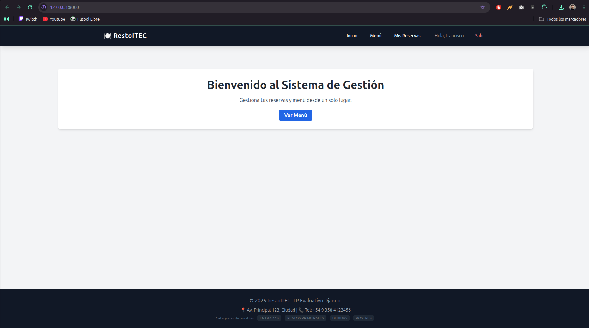
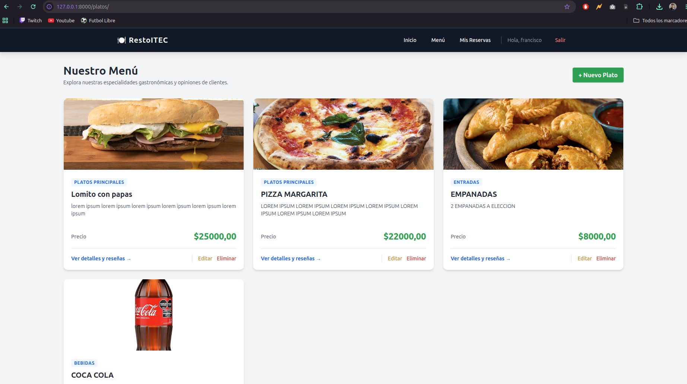
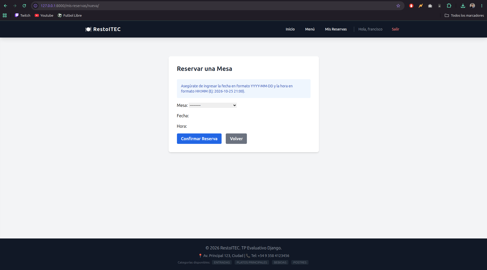

# RestoITEC - Sistema de Gestión Gastronómica

Un sistema completo de gestión para un sitio web gastronómico desarrollado con el framework **Django** y estilizado con **Tailwind CSS**. Este proyecto corresponde al Trabajo Práctico Evaluativo de la primera mitad del año.

## 🚀 Requisitos del TP e Implementación

A continuación se detalla cómo se dio cumplimiento a cada uno de los requerimientos solicitados en la consigna:

### 1. Bases de Datos
El sistema cuenta con **6 modelos** estructurados y relacionados en la base de datos:
* **Usuario:** Modelo personalizado para la gestión de cuentas.
* **Categoria:** Clasificación del menú (ej: Entradas, Platos Principales, Bebidas, Postres).
* **Plato:** Contiene la información de las comidas, precios, su categoría correspondiente y soporte para imágenes (`ImageField`).
* **Mesa:** Registro de las mesas físicas del establecimiento y su capacidad.
* **Reserva:** Vincula a un usuario con una mesa en una fecha y hora específicas, manejando estados (*Pendiente, Confirmada, Cancelada*).
* **Resena:** Permite a los usuarios calificar dinámicamente un plato (puntuación de 1 a 5 estrellas) junto con un comentario.

### 2. Usuarios y Autenticación
* **Usuario Personalizado:** Implementado utilizando `AbstractUser` desde el inicio del proyecto para garantizar la escalabilidad.
* **Registro, Login y Logout:** Interfaces limpias y traducidas al español desde los templates utilizando vistas nativas y formularios adaptados con Tailwind CSS. El cierre de sesión se realiza de forma segura mediante peticiones POST.

### 3. Vistas, Navegación y Permisos
* **CRUDs Completos:** Se desarrollaron sistemas de gestión completos desde el frontend para dos modelos clave:
    * **Platos:** (Lista, Creación, Edición y Eliminación) protegido estrictamente por el sistema de permisos nativo de Django (`PermissionRequiredMixin`), limitando el acceso de escritura solo al personal autorizado.
    * **Reservas:** Permite a cada cliente logueado crear, listar y cancelar sus propias reservas de manera dinámica, aislando sus datos mediante `LoginRequiredMixin`.
* **Panel de Administración:** Configuración avanzada en el backend con filtros laterales, ordenamiento predeterminado y barras de búsqueda para optimizar el control del flujo gastronómico.

### 4. Características Adicionales
* **Context Processor:** Se desarrolló un procesador de contexto global (`restaurante_context`) para inyectar información recurrente (datos de contacto, dirección y listado de categorías activas) de manera automática en el footer de todas las páginas del sitio.
* **Manejo de Media:** Carga funcional de imágenes para los platos del menú, configurada correctamente tanto en el entorno de desarrollo como en los formularios multimedia (`enctype="multipart/form-data"`).

---

## 🛠️ Tecnologías Utilizadas

* **Python 3.12**
* **Django 5.x**
* **Tailwind CSS** (vía CDN)
* **Pillow** (Procesamiento de imágenes)
* **SQLite** (Base de datos por defecto para desarrollo)

---

## 💻 Instalación y Configuración Local

Para ejecutar este proyecto en tu entorno local, sigue estos pasos desde la terminal:

1. **Clonar el repositorio:**
   ```bash
   git clone [https://github.com/FranAmbrogioItec/itec/tree/main/3ero/ing_software/tp_gastronomia
   cd tp_gastronomia


2. **Virtual environment**

```bash
python3 -m venv venv
source venv/bin/activate

```

3. **Instalar dependencias**

```bash
pip install django pillow 
```

4. **Migraciones**

```bash
python manage.py makemigrations
python manage.py migrate
```

5. **Crear superusuario**

```bash
python manage.py createsuperuser
```

6. **Iniciar servidor**

```bash
python manage.py runserver
```

---

## 📝 Usuarios de Prueba

Se incluyen las credenciales para acceder al sistema:

**Admin:**
* Usuario: `admin`
* Contraseña: `admin123`

**Cliente:**
* Usuario: `cliente`
* Contraseña: `cliente123`

---

## 🖼️ Capturas de Pantalla

* 
* 
* 
* 
* 


